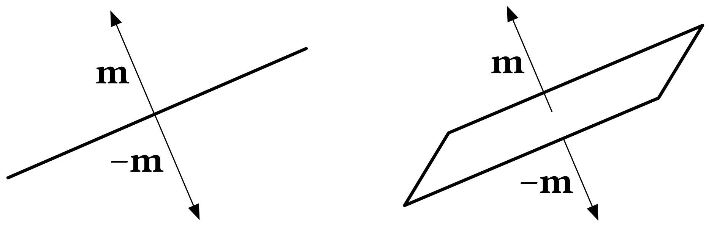

# Axes
A C++11 implementation of unit axes in both 2D and 3D, tailored for use in state estimation problems. Created by [Marc Gallant](http://kam3k.github.io), originally for use in the [Mining Systems Laboratory](https://msl.engineering.queensu.ca).

## Installation
Axes is a (single) header-only library. As a result, just drop `axes.h` somewhere in your C++ search path. However, it does depend on the [Eigen](http://eigen.tuxfamily.org/index.php?title=Main_Page) linear algebra library.

To build the unit tests, Axes uses [Cmake](https://cmake.org). You can view the unit tests in the `tests` directory, which use the popular [Catch](https://github.com/philsquared/Catch) test framework. You do not need to download anything, the Catch header is included in this repository. Make sure the path to your Eigen installation is properly configued in `CMakeLists.txt`, then from the root Axes directory:

```
$ mkdir build
$ cd build
$ cmake ..
$ make
$ ./test_axes
```

## Background

*Directions* are found in many everyday phenomena. For example, the cardinal directions measured by a compass, the direction of gravitational acceleration, or simply the direction that a car is driving relative to other cars. However, it is sometimes the case that the opposite direction conveys the same information as the direction itself. The quintessential example of this occurrence is the orientation of a plane, such as the (flat) wall of a building. One way to describe the orientation of the wall is its normal vector, which (despite its appearance) is *not* a direction. Because the orientation the wall can equivalently be described by flipping the normal vector to the opposing side of the wall, one must distinguish between the algebraic spaces of normal vectors and directions. The image below shows how an axis **m** is equivalent to –**m** (i.e., flipping **m**) and how it can be used to parameterize the orientation of a line (left) and a plane (right).



More precisely, an *axis* is an unordered pair of opposing directions. As shown in the above example, a phenomenon that is well-represented by axes is the orientation of planes, which can be parameterized using *three-dimensional* axes. Similarly, the orientation of lines (which are just lower-dimensional planes) can be parameterized using *two-dimensional* axes. This library includes special parameterizations of two-dimensional and three-dimensional axes called *unit axes*, with a focus on using them in state estimation problems. In particular, various operators acting on axes, and the encapsulation of axes as manifolds are explicitly handled.

A paper detailing the properties of three-dimensional axes is currently under review, and a thesis detailing both two-dimensional and three-dimensional axes is currently in preperation. They will be linked here once available.

## Usage

Classes and methods are in `axes` namespace. In the following examples, the following environment is assumed:

```
#include <Eigen/Dense>
#include "axes.h"
	
using namespace axes;
	
int main()
{
	// code snippets go here
}
```

I also cheat and assume the constant `PI` and function `sqrt` are defined.
	
### Two-Dimensional Axes
A two-dimensional axis is the 2x1 column

**m** = [&lambda; &kappa;]<sup>T</sup>

Two-dimensional axes are analogous to numbers in the complex plane (with real part &lambda; and imaginary part &kappa;), with the condition **m** = –**m**. The *angle* of **m** is its angle with respect to the &kappa; (imaginary) axis. Numerous examples of the different methods and functions that act on two-dimensional axes are shown here. 

#### Constructors

```cpp
// Default constructor
UnitAxis2D<double> m; // [1.0, 0.0]
UnitAxis2D<> m; // same as above (type parameter defaults to double)
UnitAxis2D<long> m; // [1.0L, 0.0L]
	
// Two-parameter constructor
UnitAxis2D<> m(0.0, 1.0) // [0.0, 1.0]
UnitAxis2D<> m(1, 1) // [sqrt(2)/2, sqrt(2)/2] (normalizes arguments)
	
// Angle constructor
UnitAxis2D<> m(0); // [1.0, 0.0]
UnitAxis2D<> m(PI); // [1.0, 0.0] (remember m = -m)
UnitAxis2D<> m(PI/4); // [sqrt(2)/2, sqrt(2)/2]
UnitAxis2D<> m(-PI/3); // [0.5, -sqrt(3)/3]
UnitAxis2D<> m(-PI/3); // [0.5, -sqrt(3)/3]   
UnitAxis2D<> m(-3*PI/4); // [sqrt(2)/2, sqrt(2)/2] (lambda kept >= 0, m = -m)
	
// Vector constructor
Eigen::Vector2d u(1, 1);
UnitAxis2D<> m(u); // same as UnitAxis2D<>(1, 1)
	
// Copy constructor
UnitAxis2D<> m(1, 1);
UnitAxis2D<> n(m); // [sqrt(2)/2, sqrt(2)/2]
```

### Introspective methods

```cpp
UnitAxis2D<> m;
UnitAxis2D<> n(1, 1);
UnitAxis2D<> p(0, -1);

// Angle
m.angle(); // 0.0
n.angle(); // PI/4
p.angle(); // PI/2

// Kappa
m.kappa(); // 0.0
n.kappa(); // sqrt(2)/2
p.kappa(); // 1 (not -1)

// Lambda
m.lambda(); // 1.0
n.lambda(); // sqrt(2)/2
p.lambda(); // 0.0

// Vector
m.vector(); // Eigen::Vector2d(1, 0)
n.vector(); // Eigen::Vector2d(sqrt(2)/2, sqrt(2)/2)
p.vector(); // Eigen::Vector2d(0, 1)
```

### Mathematical methods

```cpp
UnitAxis2D<> m;
UnitAxis2D<> n(1, 1);
UnitAxis2D<> p(0, -1);
UnitAxis2D<> q(2.3, -3.7);

// Inverse
m.inv(); // [1.0, 0.0]
n.inv(); // [sqrt(2)/2, -sqrt(2)/2]
p.inv(); // [0.0, 1.0]
q.inv(); // [0.528, 0.850]

// Log (same as angle for 2D axes)
m.log(); // 0.0
n.log(); // PI/4
p.log(); // PI/2
q.log(); // -1.01463...
```

### Operators

```cpp
UnitAxis2D<> m;
UnitAxis2D<> n(1, 1);
UnitAxis2D<> p(0, -1);

// Indexing
m[0]; // 1.0
m[1]; // 0.0
n[0]; // sqrt(2)/2
n[1]; // sqrt(2)/2
p[0]; // 0.0
p[1]; // 1.0

// Compound operator (unary plus, returns Eigen::Matrix2d)
+m; // [1.0 0.0; 0.0 1.0]
+n; // [sqrt(2)/2 -sqrt(2)/2; sqrt(2)/2 sqrt(2)/2]
+p; // [0.0 -1.0; 1.0 0.0]

// Inverse compound operator (unary minus, returns Eigen::Matrix2d)
-m; // [1.0 0.0; 0.0 1.0]
-n; // [sqrt(2)/2 sqrt(2)/2; -sqrt(2)/2 sqrt(2)/2]
-p; // [0.0 1.0; -1.0 0.0]

// Assignment
m = UnitAxis2D<>(0, 1) // m is now [0.0, 1.0]

// Equivalency
UnitAxis2D<> s;
UnitAxis2D<> t(1, 1);
UnitAxis2D<> u(0, -1);
m == m // true
m == s // true
n == n // true
n == t // true
p == p // true
p == u // true
m == n // false
m != n // true
```

### Functions

```cpp
UnitAxis2D<> m;
UnitAxis2D<> n(1, 1);
UnitAxis2D<> p(0, -1);
UnitAxis2D<> q(sqrt(3)/2, 0.5);
UnitAxis2D<> r(0.5, -sqrt(3)/2);

// Boxminus (UnitAxis2D - UnitAxis2D with result converted to angle)
boxminus(m, m); // 0.0
boxminus(q, r); // PI/2
boxminus(r, q); // PI/2
boxminus(p, q); // PI/3
boxminus(q, p); // -PI/3
boxminus(r, n); // PI - 7*PI/12

// Boxplus (UnitAxis2D + angle with result as UnitAxis2D)
boxplus(m, 0.0); // m
boxplus(m, PI/4); // n
boxplus(m, -PI/3); // r
boxplus(q, -PI/2); // r
boxplus(r, PI/2); // q

// Distance (positive angle between two UnitAxis2D instances)
distance(m, n); // PI/4
distance(m, m); // 0.0
distance(p, q); // PI/3
distance(q, p); // PI/3

// Dot (absolute dot product between two axes, always positive)
dot(m, n); // cos(PI/4)
dot(q, r); // cos(PI/2)
dot(m, m); // cos(0.0)
dot(p, q); // cos(PI/3)
dot(r, n); // cos(PI - 7*PI/12)
```

### Three-Dimensional Axes
(coming soon)

## Issues and Contact

If you discover any problems, I'd appreciate if you submitted them via the issue tracker. Pull requests are certainly welcome! Otherwise, you can find my contact info on my website linked at the beginning of this README.